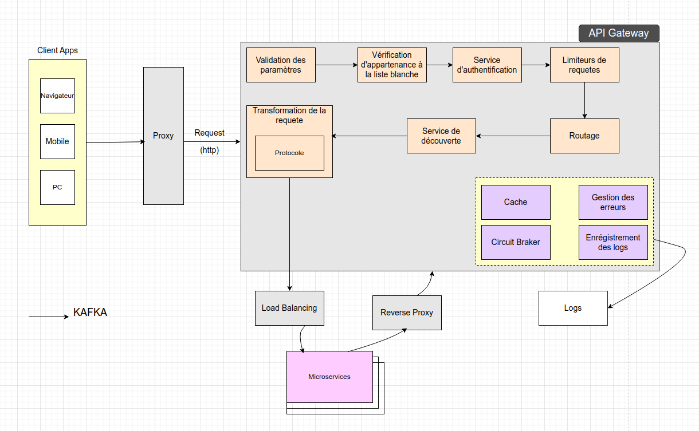
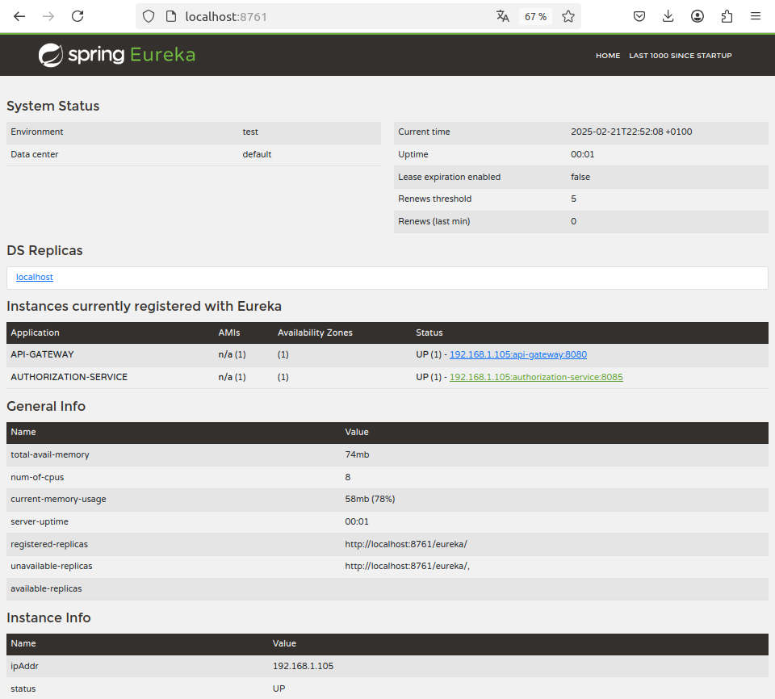
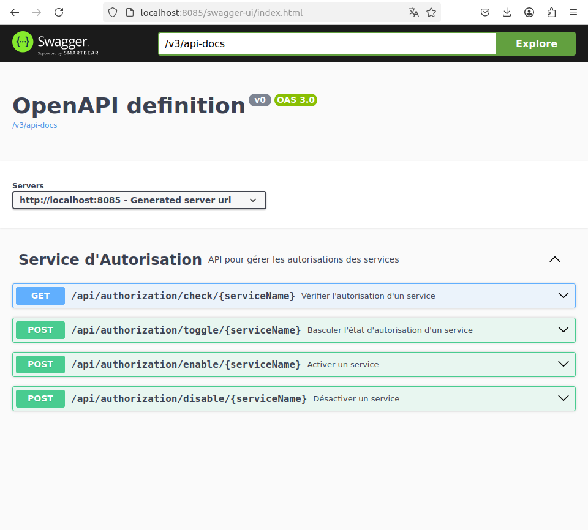
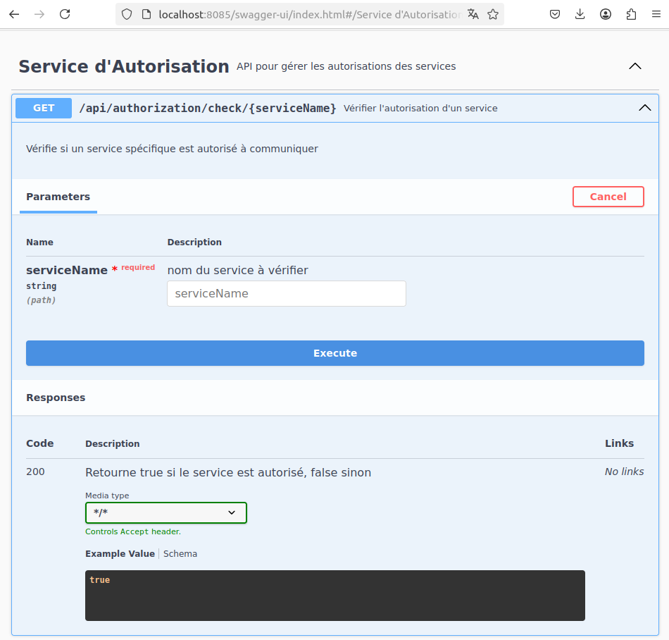
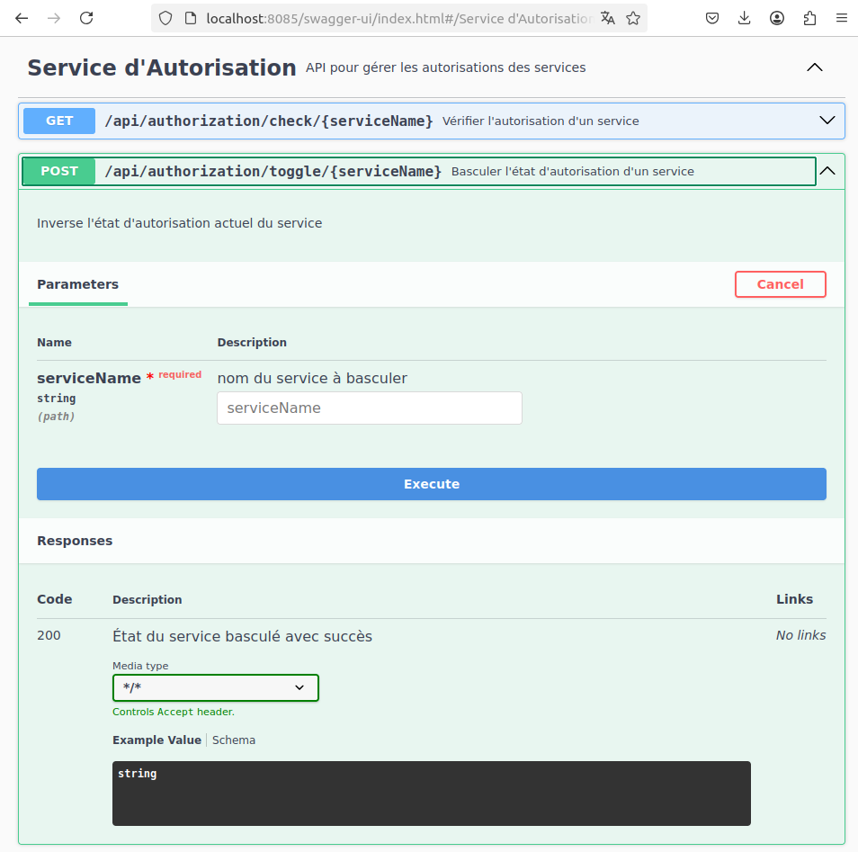

# api_gateway avec un service d'autorisation

(Eureka Server, Config Server, API Gateway, Kafka, JWT, Authentication, Authorization, Redis, Docker)

# À propos du projet

<ul style="list-style-type:disc">
  <li>Ce projet est basé sur Spring Boot </li>
  
  <li>Un service ou un client peut envoyer une demande au service concerné par l'intermédiaire de la passerelle api avec son jeton ou token et cette requête sera filtrée pour vérifier que le service concerné est bien inscrit dans l'annuaire ou fait partir des services autorisés.</li>
</ul>

Nous avons 4 services
- Le serveur de configuration
- Le serveur Eureka
- API Gateway
- Le service d'autorisation


### Les dépendances utilisées

* Core
    * Spring
        * Spring Boot
        * Spring Security
            * Spring Security JWT
            * Authentication
            * Authorization
        * Spring Web
            * FeighClient
        * Spring Data
            * Spring Data JPA
            * PostgreSql
        * Spring Cloud
            * Spring Cloud Gateway Server
            * Spring Cloud Config Server
            * Spring Cloud Config Client
    * Netflix
        * Eureka Server
        * Eureka Client
* Database
    * POstgreSql
* Kafka
* Redis
* Docker 
* Validation
* Modelmapper
* Openapi UI
* Lombok
* Log4j2


### 🔨 Lancer ou Éxécuter l'application

<b>Localement</b>

<b>1 )</b> Cloner le projet ou télécharger le .zip

<b>2 )</b> Aller sur le dossier où se trouve le projet :  `cd api_gateway`

<b>3 )</b> Lancer docker compose<b>`docker compose up`</b></b>

<b>4 )</b> Lancer <b>Eureka Server</b> 

```bash
cd eureka-server
mvn spring-boot:run
```

<b>5 )</b> Lancer <b>La Gateway</b>

```bash
cd gateway
mvn spring-boot:run
```

<b>6 )</b> Lancer <b>Le serveur de configuration</b>

```bash
cd config-server
mvn spring-boot:run
```

<b>7 )</b> Lancer  <b>Le service d'autorisation</b>

```bash
cd auth-service
mvn spring-boot:run
```

<b>8 )</b> Pour le swagger du service d'autorisation, aller à localhost:8085/swagger-ui.html</b>

### Documentation

## architecture


## Dashboard Eureka 


## Swagger






### Participants
- **FOTSO NANA** - marcfotso20@gmail.com
- **TAZO Belle-Nickelle** - bellenickelletazo@gmail.com
- **BELINGA Yan** - belingaYan7@gmail.com
- **DJIFACK Line Audrey** - djifacklineaudrey@gmail.com
- **BEKALE EKO Yann** - yannbiko@gmail.com
  
# gateway_api
